How do American lifestyles affect steak preference?
================
Megan Mason, Gwen Hammond, and Ryan Jensen
2025-03-27

## Introduction

According to the United States Department of Agriculture, “The 2025 beef
production outlook is raised by 15 million pounds from last month to
26.700 billion pounds”. We have also been importing more beef this past
year, and that is expected to continue even through tariffs. These
tariffs will also raise the price of beef. Because beef is a such an
important commodity and prices are expected to increase soon, it is also
important that we know how to prepare it so it isn’t wasted when we do
have it. We want to find out if there are certain factors in the
American lifestyle that correlate with how people prefer their steak
prepared. This information could be valuable to steakhouses and
restaurants that sell steak and are affected by the current economic
environment. With prices rising, people are less likely to go out and
price of ingredients will increase. Therefore, it is important for
restaurants to know their clients, and if certain behaviors/lifestyles
affect how customers prefer steak. Then, they would be able to cater to
their clients with less wasted food and earn more money. individuals
will feel that their money was well spent, and restaurants will have
better business. Some potential questions that we are interested in
examining are:

- How does household income affect whether individuals eat steak?
- How does age, location, and education affect how individuals like
  their steak prepared?
- How does drinking alcohol and smoking cigarettes influence how those
  prefer their steak prepared?

# The Data

This data set looks at social factors and risky behaviors that are found
in the American lifestyle. The purpose of this data set is to predict
how lifestyle choices correlate with how Americans like there steak. The
data set contains 551 observations and has 15 variables which are mainly
categorical. The data set we chose lists 12 factors that could
contribute to how people prefer their steak cooked, which are listed
below.

- Lottery: two hypothetical betting situations, the individual picks the
  one they think is the safer bet, response = A/B
- Smoke.Cigarettes: does the individual smoke cigarettes, response =
  yes/no
- Drink.Alcohol: does the individual drink alcohol, response = yes/no
- Gamble: does the individual gamble, response = yes/no
- Skydiving: does the individual go skydiving, response = yes/no
- Speed: does the individual speed while driving, response = yes/no
- Affair: has the individual ever cheated on their partner, response =
  yes/no
- Gender: how does the individual identify, response = male/female
- Age: how old is the individual, response = 18-29, 30-44, 45-60, \>60
- Household.Income: what is the individual’s household income, response
  = 0-24,999; 25,000-49,999; 50,000-99,999; 100,999-149,999; 150,000+
- Education: What is the highest level of education individual attained,
  response = Less than high school degree, High school degree, Some
  college or Associate degree, Bachelor degree, Graduate degree
- Location: Where is the individual from, response = New England, Middle
  Atlantic, South Atlantic, East North Central, East South Central, West
  South Central, West North Central, Mountain
- There are three variables that are not explanatory:
  - RespondentID: arbitrary number, not useful for analysis
  - Prepared: How individual likes steak prepared, the response variable
    under question, response= rare, medium rare, medium, medium well,
    and well done. This is the primary response variable we are
    interested in exploring.
  - Consume.Steak: Does the individual consume steak, another response
    variable under question, though we are not as interested in this as
    we are in how steak is prepared.

## Cleaning the Data

- Megan started off cleaning the data by re-naming the columns so that
  they are easier to work with.

- Gwen created a subset of the data where missing values are excluded.

- Ryan created subsets of people who do eat steak and who don’t eat
  steak.

``` r
#Gwen's Code
clean_steak <- steak[complete.cases(steak), ]

anyNA(clean_steak)
```

    ## [1] FALSE

``` r
#Ryan's Code
library(tidyverse)
```

    ## Warning: package 'tidyverse' was built under R version 4.4.2

    ## Warning: package 'forcats' was built under R version 4.4.2

    ## Warning: package 'lubridate' was built under R version 4.4.2

    ## ── Attaching core tidyverse packages ──────────────────────── tidyverse 2.0.0 ──
    ## ✔ dplyr     1.1.4     ✔ purrr     1.0.2
    ## ✔ forcats   1.0.0     ✔ stringr   1.5.1
    ## ✔ ggplot2   3.5.1     ✔ tibble    3.2.1
    ## ✔ lubridate 1.9.4     ✔ tidyr     1.3.1
    ## ── Conflicts ────────────────────────────────────────── tidyverse_conflicts() ──
    ## ✖ dplyr::filter() masks stats::filter()
    ## ✖ dplyr::lag()    masks stats::lag()
    ## ✖ purrr::map()    masks maps::map()
    ## ℹ Use the conflicted package (<http://conflicted.r-lib.org/>) to force all conflicts to become errors

``` r
eat_steak <- clean_steak %>% 
  filter(Consume.Steak == "Yes")

no_steak <- clean_steak %>% 
  filter(Consume.Steak == "No")

# View(eat_steak)
# View(no_steak)
```

Megan’s Code:

``` r
#MEGAN'S CODE
steak_colors <- c(
  "Rare" = "#f00000",        # light pink
  "Medium rare" = "#d00000",
  "Medium" = "#b00000",
  "Medium Well" = "#900000",
  "Well" = "#700000"     # dark red
)

clean_steak$Education <- factor(clean_steak$Education, 
                             levels = c('Less than high school degree', 'High school degree', 'Some college or Associate degree', 'Bachelor degree', 'Graduate degree'))
clean_steak$Location <- factor(clean_steak$Location,
                             levels = c("New England", "Middle Atlantic", "South Atlantic", "East North Central", "East South Central", "West South Central", "West North Central",  "Mountain", "Pacific", ""))

eat_steak$Prepared <- factor(eat_steak$Prepared, 
                             levels = c('Rare', 'Medium rare', 'Medium', 'Medium Well', 'Well'))
eat_steak$Education <- factor(eat_steak$Education, 
                             levels = c('Less than high school degree', 'High school degree', 'Some college or Associate degree', 'Bachelor degree', 'Graduate degree'))

eat_steak$Location <- factor(eat_steak$Location,
                             levels = c("New England","Middle Atlantic", "South Atlantic", "East North Central", "East South Central", "West South Central", "West North Central",  "Mountain", "Pacific", ""))

total_preference <- eat_steak %>%
  group_by(Prepared) %>%
  count()
total_preference
```

    ## # A tibble: 5 × 2
    ## # Groups:   Prepared [5]
    ##   Prepared        n
    ##   <fct>       <int>
    ## 1 Rare           23
    ## 2 Medium rare   166
    ## 3 Medium        132
    ## 4 Medium Well    74
    ## 5 Well           35

``` r
eat_steak %>%
  filter(Affair != '') %>%
  filter(`Consume.Steak` != "") %>%
  group_by(Affair) %>%
  count(Prepared) %>%
  mutate(percentage_prepared = n / sum(n)) %>% 
  ggplot(aes(x=factor(Affair), y=percentage_prepared, fill=Prepared)) +
  geom_col(position="dodge") +
  scale_fill_manual(values = steak_colors) + 
  theme_minimal() +
  labs(x="affair", y="Percentage", fill="How do you like it prepared?")
```

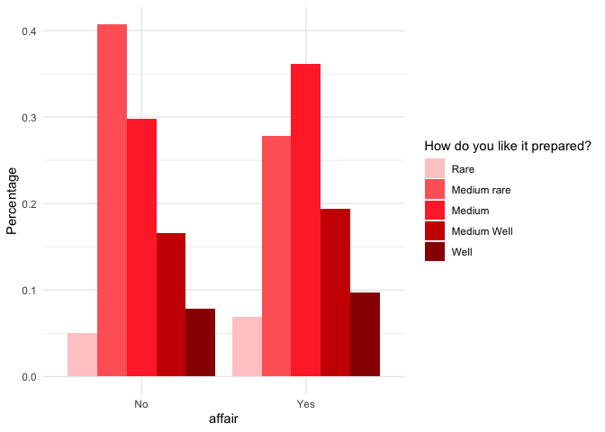<!-- -->

``` r
eat_steak %>%
  filter(Education != '') %>%
  filter(`Consume.Steak` != "") %>%
  group_by(Education) %>%
  count(Prepared) %>%
  mutate(percentage_prepared = n / sum(n)) %>% 
  ggplot(aes(x=factor(Education), y=percentage_prepared, fill=Prepared)) +
  geom_col(position="dodge") +
  scale_fill_manual(values = steak_colors) +  # apply custom color scale
  coord_flip() +
  theme_minimal() +
  labs(x="education", y="Percentage", fill="How do you like it prepared?")
```

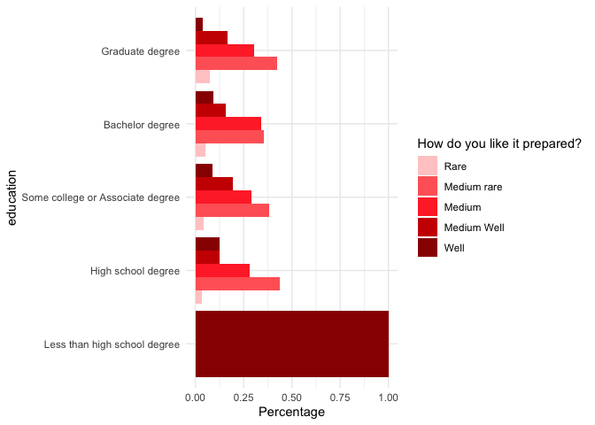<!-- -->

``` r
#This was considered but there was little correlation so it's just here for records:
clean_steak %>%
  filter(Affair != '') %>%
  filter(`Consume.Steak` != "") %>%
  group_by(`Consume.Steak`) %>%
  count(Affair) %>%
  mutate(percentage_total = n / sum(n)) %>%
  ggplot(aes(x=factor(`Consume.Steak`), y=percentage_total, fill=Affair)) +
  geom_col(position="dodge") +
  theme_minimal() +
  labs(x="consume steak", y="Percentage", fill="Affair")
```

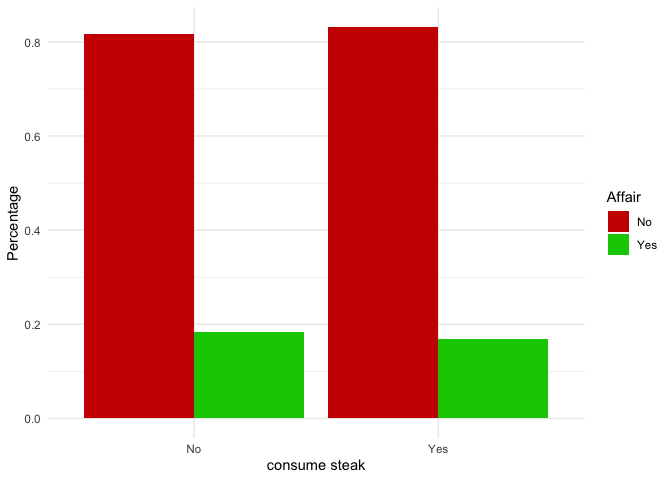<!-- -->

``` r
#This was considered but the how you like it prepared is more informative on which steak preparation style is better
clean_steak %>%
  filter(Education != '') %>%
  filter(`Consume.Steak` != "") %>%
  group_by(Education) %>%
  count(`Consume.Steak`) %>%
  mutate(percentage_total = n / sum(n)) %>%
  ggplot(aes(x=factor(Education), y=percentage_total, fill=`Consume.Steak`)) +
  geom_col(position="dodge") +
  coord_flip() +
  theme_minimal() +
  labs(x="Education", y="Percentage", fill="Eat Steak")
```

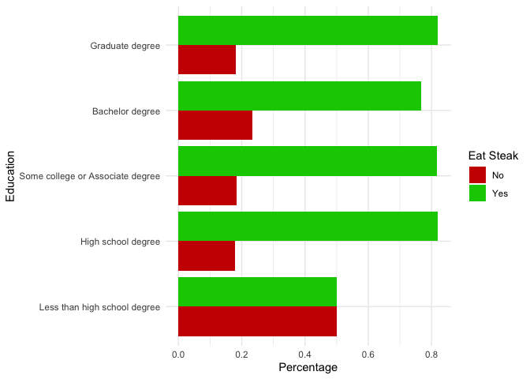<!-- -->

``` r
#This was used to find which two preferences are most popular for map below
eat_steak %>%
  filter(Location != '') %>%
  filter(`Consume.Steak` != "") %>%
  group_by(Location) %>%
  count(Prepared) %>%
  mutate(percentage_prepared = n / sum(n)) %>% 
  ggplot(aes(x=factor(Location), y=percentage_prepared, fill=Prepared)) +
  geom_col(position="dodge") +
  coord_flip() +
  theme_minimal() +
  labs(x="Location", y="Percentage", fill="How do you like it prepared?")
```

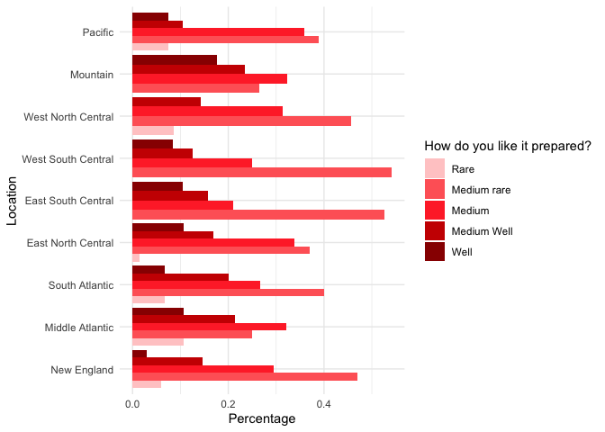<!-- -->

``` r
megan_eat_steak <- eat_steak %>%
  rename(`region.y` = Location)

preference_summary <- megan_eat_steak %>%
  filter(`region.y` != '') %>%
  filter(`Consume.Steak` != "") %>%
  group_by(`region.y`) %>%
  summarize(percent_rare = mean(Prepared == "Medium rare") * 100,
            percent_medium = mean(Prepared == "Medium") * 100)

state_region <- tibble(
  state = tolower(state.name),
  region = case_when(
    state %in% c("maine", "new hampshire", "vermont", "massachusetts", "rhode island", "connecticut") ~ "New England",
    state %in% c("new york", "new jersey", "pennsylvania") ~ "Middle Atlantic",
    state %in% c("delaware", "maryland", "district of columbia", "virginia", "west virginia", "north carolina", "south carolina", "georgia", "florida") ~ "South Atlantic",
    state %in% c("ohio", "indiana", "illinois", "michigan", "wisconsin") ~ "East North Central",
    state %in% c("kentucky", "tennessee", "mississippi", "alabama") ~ "East South Central",
    state %in% c("texas", "oklahoma", "arkansas", "louisiana") ~ "West South Central",
    state %in% c("north dakota", "south dakota", "nebraska", "kansas", "minnesota", "iowa", "missouri") ~ "West North Central",
    state %in% c("montana", "idaho", "wyoming", "colorado", "new mexico", "arizona", "utah", "nevada") ~ "Mountain",
    state %in% c("washington", "oregon", "california", "alaska", "hawaii") ~ "Pacific",
    TRUE ~ NA_character_
  )
)

us_map <- map_data("state")
us_map <- us_map %>%
  left_join(state_region, by = c("region" = "state"))

us_map <- us_map %>%
  left_join(preference_summary, by = "region.y")
us_map_long <- us_map %>%
  pivot_longer(
    cols = c(percent_rare, percent_medium),
    names_to = "preference",
    values_to = "percent"
  ) %>%
  mutate(preference = recode(preference,
                             percent_rare = "Medium Rare",
                             percent_medium = "Medium"))

ggplot(us_map_long, aes(x = long, y = lat, group = group, fill = percent)) +
  geom_polygon(color = "white") +
  coord_fixed(1.3) +
  theme_void() +
  scale_fill_gradient(low = "pink", high = "darkred", na.value = "grey90") +
  labs(
    title = "Steak Preference by Region",
    fill = "Percent Preference"
  ) +
  facet_wrap(~ preference, ncol = 2) +
  theme(
    plot.title = element_text(hjust = 0.5, size = 18, face = "bold"),
    strip.text = element_text(size = 14, face = "bold"),
    legend.position = "right"
  )
```

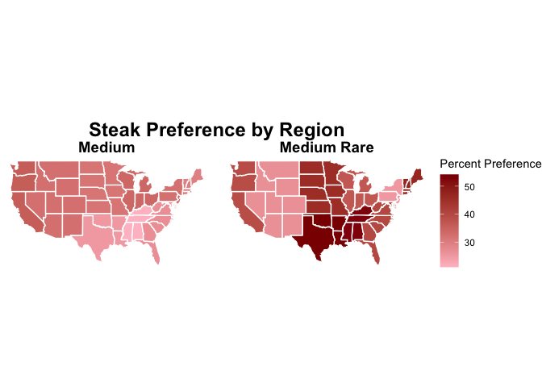<!-- -->

### Megan’s Conclusions

- If you are opening a restaurant in the southern or midwest states,
  medium rare would be the best choice for preparing your steak.
- Those who have an affair are more likely to prefer steak cooked longer
  than those who have not had an affair.
- As the level of education increases, so does the preference for rare
  steak. As the level of education increases, the preference for
  well-done steak decreases.
- Across all responses, medium-rare is the most popular choice.

Gwen’s Code:

``` r
clean_steak %>%
  filter(!is.na(Prepared) & Prepared != "") %>%
  count(Prepared, sort = TRUE)
```

    ##      Prepared   n
    ## 1 Medium rare 166
    ## 2      Medium 132
    ## 3 Medium Well  75
    ## 4        Well  36
    ## 5        Rare  23

``` r
# Filter out blanks and NAs
clean_steak_filtered <- clean_steak %>%
  filter(
    !is.na(Age) & Age != "",
    !is.na(Gender) & Gender != "",
    !is.na(Gamble) & Gamble != "",
    !is.na(Consume.Steak) & Consume.Steak != ""
  )
```

``` r
#facet wrap for steak preperation by age and gender
# ggplot(clean_steak_filtered %>% filter(Prepared != ""), aes(x = Prepared, fill = factor(Age))) +
#   geom_bar(position = "dodge") +
#   theme_minimal() +
#   labs(
#     title = "Age vs Steak Preparation by Gender",
#     x = "Steak Preparation",
#     y = "Count",
#     fill = "Age"
#   ) +
#   facet_wrap(~ Gender) +
#     theme(axis.text.x = element_text(angle = 45, hjust = 1))
# Set steak preparation order
prep_levels <- c("Rare", "Medium rare", "Medium", "Medium Well", "Well")

# Set age levels in order (adjust if needed)
age_levels <- c("18-29", "30-44", "45-60", "60+")

# Clean and prepare the data
clean_steak_filtered <- clean_steak_filtered %>%
  filter(Prepared != "", !is.na(Prepared), !is.na(Age)) %>%
  mutate(
    Prepared = factor(Prepared, levels = prep_levels),
    Age = factor(Age, levels = age_levels)
  )

# Custom colors for steak prep
steak_colors <- c(
  "Rare" = "#ffcccc",
  "Medium rare" = "#ff6666",
  "Medium" = "#ff3333",
  "Medium Well" = "#cc0000",
  "Well" = "#990000"
)

# Create the plot
ggplot(clean_steak_filtered %>% filter(Prepared != ""), aes(x = Age, fill = Prepared)) +
  geom_bar(position = "dodge") +
  scale_fill_manual(values = steak_colors, drop = FALSE) +
  theme_minimal() +
  labs(
    title = "Steak Preparation Preference by Age Group and Gender",
    x = "Age Group",
    y = "Count",
    fill = "Steak Preparation"
  ) +
  facet_wrap(~ Gender) +
  theme(
    axis.text.x = element_text(angle = 45, hjust = 1),
    plot.title = element_text(face = "bold", size = 14)
  )
```

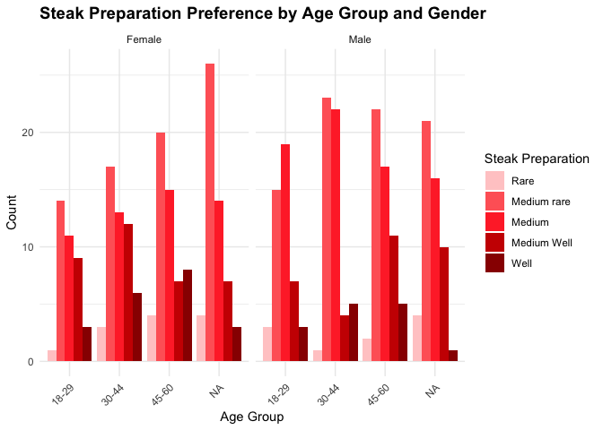<!-- -->

``` r
###########################################################
# Stacked bar chart of steak prep by age and gender
ggplot(clean_steak_filtered %>% filter(Prepared != ""), aes(x = Age, fill = Prepared)) +
  geom_bar(position = "stack") +
  scale_fill_manual(values = steak_colors, drop = FALSE) +
  theme_minimal() +
  labs(
    title = "Steak Preparation Preference by Age Group and Gender (Stacked)",
    x = "Age Group",
    y = "Count",
    fill = "Steak Preparation"
  ) +
  facet_wrap(~ Gender) +
  theme(
    axis.text.x = element_text(angle = 45, hjust = 1, face = "bold"),
    plot.title = element_text(face = "bold", size = 14)
  )
```

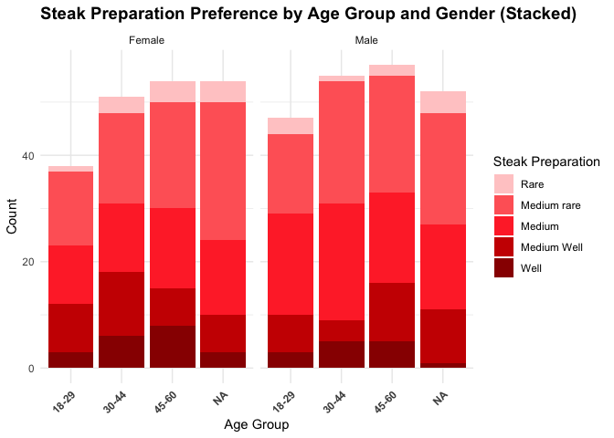<!-- -->

``` r
# # Facet Wrap: Eat Steak by Gender
# ggplot(clean_steak_filtered, aes(x = factor(Age), fill = Consume.Steak)) +
#   geom_bar(position = "dodge") +
#   theme_minimal() +
#   labs(
#     title = "Age vs Steak Consumption by Gender",
#     x = "Age",
#     y = "Count",
#     fill = "Eat Steak"
#   ) +
#   facet_wrap(~ Gender)

###########################################################

# Custom distinct colors for steak consumption
consume_colors <- c("Yes" = "#00cc00", "No" = "#cc0000")  # Green for Yes, Red for No

# Ensure Age is ordered from youngest to oldest
age_order <- c("18-29", "30-44", "45-60", "60+")

# Clean data, order Age, and remove NA age group
clean_steak_filtered <- clean_steak %>%
  filter(
    !is.na(Age) & Age != "",
    !is.na(Gender) & Gender != "",
    !is.na(Consume.Steak) & Consume.Steak != ""
  ) %>%
  mutate(Age = factor(Age, levels = age_order))

# Stacked bar chart with ordered Age, excluding NA group
ggplot(clean_steak_filtered %>% filter(Age != ""), aes(x = Age, fill = Consume.Steak)) +
  geom_bar(position = "stack") +
  scale_fill_manual(values = consume_colors) +
  theme_minimal() +
  labs(
    title = "Age vs Steak Consumption by Gender (Stacked, Ordered Age, No NA)",
    x = "Age Group",
    y = "Count",
    fill = "Consumes Steak"
  ) +
  facet_wrap(~ Gender) +
  theme(
    axis.text.x = element_text(angle = 45, hjust = 1, face = "bold"),
    plot.title = element_text(face = "bold", size = 14)
  )
```

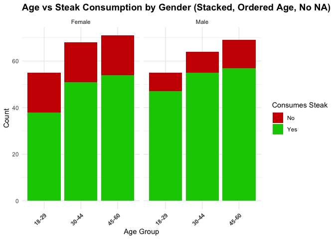<!-- -->

``` r
# Heatmap: Gender vs Steak Preparation
# clean_steak_filtered <- clean_steak %>%
#   filter(!is.na(Prepared) & Prepared != "", !is.na(Gender) & Gender != "")
# 
# clean_steak_filtered %>%
#   count(Gender, Prepared) %>%
#   ggplot(aes(x = Gender, y = Prepared, fill = n)) +
#   geom_tile(color = "white") +
#   scale_fill_gradient(low = "lightblue", high = "darkblue") +
#   theme_minimal() +
#   labs(
#     title = "Heatmap of Gender vs Steak Preparation",
#     x = "Gender",
#     y = "Steak Preparation",
#     fill = "Count"
#   )

# Define steak preparation order
prep_levels <- c("Rare", "Medium rare", "Medium", "Medium Well", "Well")

# Filter and prepare data
clean_steak_filtered <- clean_steak %>%
  filter(!is.na(Prepared) & Prepared != "", !is.na(Gender) & Gender != "") %>%
  mutate(Prepared = factor(Prepared, levels = prep_levels))

# Create heatmap
clean_steak_filtered %>%
  count(Gender, Prepared) %>%
  ggplot(aes(x = Gender, y = Prepared, fill = n)) +
  geom_tile(color = "white") +
  scale_fill_gradient(low = "#ffcccc", high = "#990000") +  # light red to dark red
  theme_minimal() +
  labs(
    title = "Heatmap of Gender vs Steak Preparation",
    x = "Gender",
    y = "Steak Preparation",
    fill = "Count"
  ) +
  theme(
    axis.text.x = element_text(face = "bold"),
    axis.text.y = element_text(face = "bold"),
    plot.title = element_text(face = "bold", size = 14)
  )
```

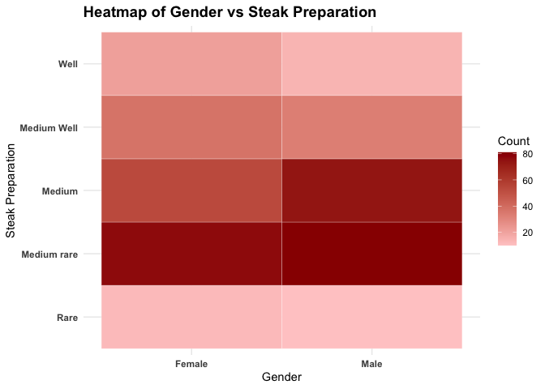<!-- -->

``` r
# # Filter out blanks and NAs
# clean_steak_filtered <- clean_steak %>%
#   filter(
#     !is.na(Age) & Age != "",
#     !is.na(Gender) & Gender != "",
#     !is.na(Gamble) & Gamble != "",
#     !is.na(Consume.Steak) & Consume.Steak != ""
#   )
# 
# ggplot(clean_steak_filtered %>% filter(Prepared != ""), aes(x = Gamble, fill = Prepared)) +
#   geom_bar(position = "dodge") +
#   theme_minimal() +
#   labs(
#     x = "Gamble",
#     y = "Count",
#     fill = "Prepared",
#     title = "Gambling vs How You Like It Prepared"
#   )
# 
# ggplot(clean_steak_filtered %>% filter(Consume.Steak != ""), aes(x = Gamble, fill = Consume.Steak)) +
#   geom_bar(position = "dodge") +
#   theme_minimal() +
#   labs(
#     x = "Gamble",
#     y = "Count",
#     fill = "Eat Steak",
#     title = "Gambling vs Steak Consumption (Yes vs No)"
#   )
# Define ordered steak preparation levels
prep_levels <- c("Rare", "Medium rare", "Medium", "Medium Well", "Well")

# Clean the data and factor preparation
clean_steak_filtered <- clean_steak %>%
  filter(
    !is.na(Age) & Age != "",
    !is.na(Gender) & Gender != "",
    !is.na(Gamble) & Gamble != "",
    !is.na(Consume.Steak) & Consume.Steak != "",
    !is.na(Prepared) & Prepared != ""
  ) %>%
  mutate(Prepared = factor(Prepared, levels = prep_levels))

# Custom steak colors (light to dark red)
steak_colors <- c(
  "Rare" = "#ffcccc",
  "Medium rare" = "#ff6666",
  "Medium" = "#ff3333",
  "Medium Well" = "#cc0000",
  "Well" = "#990000"
)

# Plot 1: Gambling vs Steak Preparation
ggplot(clean_steak_filtered, aes(x = Gamble, fill = Prepared)) +
  geom_bar(position = "dodge") +
  scale_fill_manual(values = steak_colors, drop = FALSE) +
  theme_minimal() +
  labs(
    x = "Gambles",
    y = "Count",
    fill = "Steak Preparation",
    title = "Gambling vs How You Like Your Steak Prepared"
  ) +
  theme(
    axis.text.x = element_text(face = "bold"),
    plot.title = element_text(face = "bold", size = 14)
  )
```

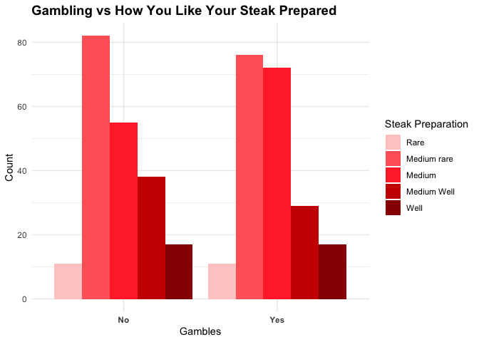<!-- -->

``` r
###########################################################
# Stacked bar chart of steak prep by gambling, faceted by gender
ggplot(clean_steak_filtered, aes(x = Gamble, fill = Prepared)) +
  geom_bar(position = "stack") +
  scale_fill_manual(values = steak_colors, drop = FALSE) +
  theme_minimal() +
  labs(
    title = "Gambling vs Steak Preparation by Gender (Stacked)",
    x = "Gambles",
    y = "Count",
    fill = "Steak Preparation"
  ) +
  facet_wrap(~ Gender) +
  theme(
    axis.text.x = element_text(face = "bold"),
    plot.title = element_text(face = "bold", size = 14)
  )
```

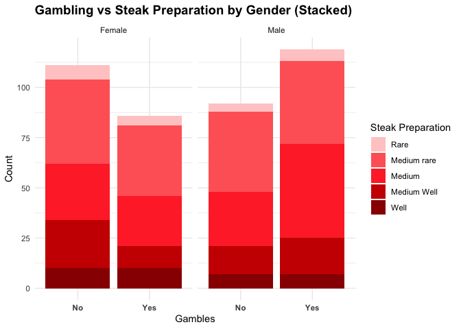<!-- -->

## Gwen’s Conclusions

- Gender

  - Gender differences in steak preparation preferences are present but
    not as highly significant as other factors. I was surprised by this
    due to the nature of females being more cautious than males, given
    eating under cooked meat could give diseases.

  - This insight could be valuable to marketers or restaurants showing
    that their advertisements for steak products does not need to
    heavily target a specific gender.

- Age

  - As age increases, there is a noticeable shift towards well-done
    steaks, with the older age group of 60+ showing a stronger
    preference for well-done or medium well preparations, while the
    younger age groups prefer medium rare or medium.

  - This information can be helpful for food service providers and
    restaurants because it can help tailor menus or they can give
    cooking recommendations based on the age demographics of their
    customers, which could increase sales and customer satisfaction.

  - I would be interested to see how little kids would answer this
    question, given that very likely their parents and/or guardian chose
    for them. I think that it would also be interesting to see if people
    of the same family have the same preferences, or if they all like it
    cooked a different way.

- Gambling

  - According to the graph, there is not much difference on steak
    preference base on whether a person gambles or not. the biggest
    difference is that people who gamble have a higher tendency to chose
    medium and medium rare then people who are non gamblers.

  - This connection could possibly reflect a broader behavioral pattern
    where people who are more open to risk could make bolder food
    choices or more expensive food choices.

  - This information would be useful for casinos, nightlife venues, and
    surrounding food businesses and restaurants. Making sense of this
    information can help to create menu planning and give strategies to
    help engage consumers.

Ryan’s Code:

``` r
noNA_Income <- clean_steak %>% 
  filter(!(Household.Income == "")) 
total_rows <- nrow(noNA_Income)

noNA_Income %>% 
  mutate(Household.Income = factor(Household.Income, levels = c("$0 - $24,999", "$25,000 - $49,999", "$50,000 - $99,999", "$100,000 - $149,999", "$150,000+"))) %>% 
  group_by(Household.Income) %>% 
  summarise(
    group_percent = n() / total_rows
  ) %>% 
  ggplot(aes(x = "", y = group_percent, fill = Household.Income)) + 
  geom_bar(width = 1, stat = "identity") + coord_polar("y") + theme_void() + labs(title = "Percentage of Respondents in Income Group", fill = "Household Income Group")
```

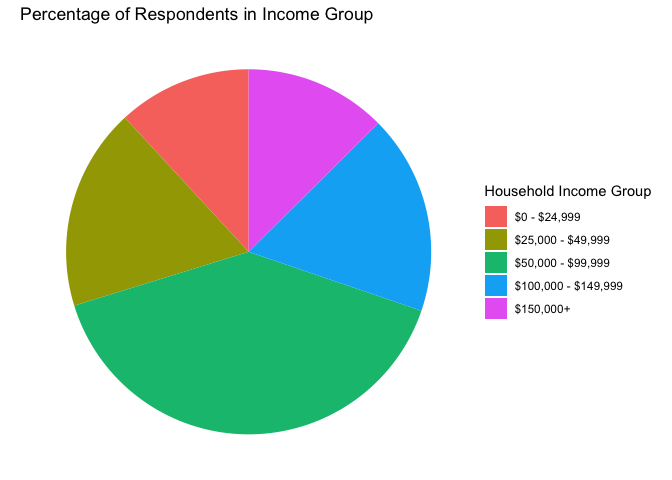<!-- -->

- Analyzing the pie chart of the percentages of respondents in each
  income category, it is clear the category from \$50,000-\$99,999 has a
  much greater number of respondents then the other 4 categories. The
  other 4 income categories are all mostly similar in the percent of
  respondents in the category. This must be considered when analyzing if
  respondents consume steak and how they prefer it prepared within each
  income group.

``` r
clean_steak %>% 
  filter(!Household.Income == "", !Consume.Steak == "") %>% 
  mutate(Household.Income = factor(Household.Income, levels = c("$0 - $24,999", "$25,000 - $49,999", "$50,000 - $99,999", "$100,000 - $149,999", "$150,000+"))) %>% 
  group_by(
    Household.Income, Consume.Steak
  ) %>% 
  summarise(
    eat_steak = n()
  ) %>% 
  ggplot(aes(x = Household.Income, y = eat_steak, fill = Consume.Steak)) + geom_col() + labs(x = "Household Income", y = "Number of Respondents", fill = "Consume Steak", title = "Household Income vs If Individual Consumes Steak") + coord_flip()
```

    ## `summarise()` has grouped output by 'Household.Income'. You can override using
    ## the `.groups` argument.

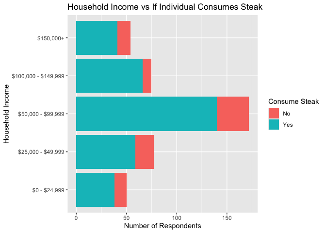<!-- -->

``` r
clean_steak %>% 
  filter(!Household.Income == "", !Consume.Steak == "") %>% 
  mutate(Household.Income = factor(Household.Income, levels = c("$0 - $24,999", "$25,000 - $49,999", "$50,000 - $99,999", "$100,000 - $149,999", "$150,000+"))) %>% 
  group_by(
    Household.Income, Consume.Steak
  ) %>% 
  summarise(
    eat_steak = n()
  ) %>% 
  ggplot(aes(x = Household.Income, y = eat_steak, fill = Consume.Steak)) + geom_col(position = "fill") + labs(x = "Household Income", y = "Number of Respondents", fill = "Consume Steak", title = "Household Income vs If Individual Consumes Steak") + coord_flip()
```

    ## `summarise()` has grouped output by 'Household.Income'. You can override using
    ## the `.groups` argument.

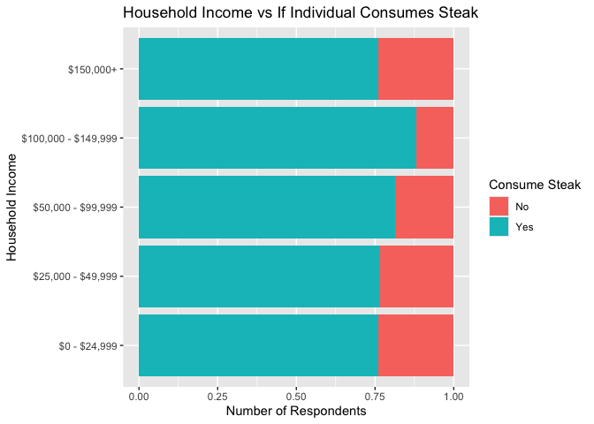<!-- -->

- There appears to be no true relationship between the household income
  of the individual and if they consume steak. All bars appear to have a
  majority of individuals who consume steak, and there appears to be no
  trend between the income and amount of individuals who do or do not
  consume steak.

``` r
steak_colors <- c(
  "Rare" = "#ffcccc",
  "Medium rare" = "#ff6666",
  "Medium" = "#ff3333",
  "Medium Well" = "#cc0000",
  "Well" = "#990000"
)
```

Creates steak_colors vector which holds the possible values for
Prepared, and matches them with a color for better visualization.

``` r
eat_steak %>% 
  filter(!Household.Income == "", !is.na(Prepared)) %>% 
  mutate(Household.Income = factor(Household.Income, levels = c("$0 - $24,999", "$25,000 - $49,999", "$50,000 - $99,999", "$100,000 - $149,999", "$150,000+"))) %>% 
  mutate(Prepared = factor(Prepared, levels = c("Rare", "Medium rare", "Medium", "Medium Well", "Well"))) %>% 
  group_by(Household.Income, Prepared) %>% 
  summarise(
    prepared_number = n()
  ) %>% 
  ggplot(aes(x = Household.Income, y = prepared_number, fill = Prepared)) + geom_col() + coord_flip() + labs(x = "Household Income", y = "Number of Respondents", fill = "Prepared Preference", title = "Household Income vs. Preference on Preparation of Steak") + scale_fill_manual(values = steak_colors)
```

    ## `summarise()` has grouped output by 'Household.Income'. You can override using
    ## the `.groups` argument.

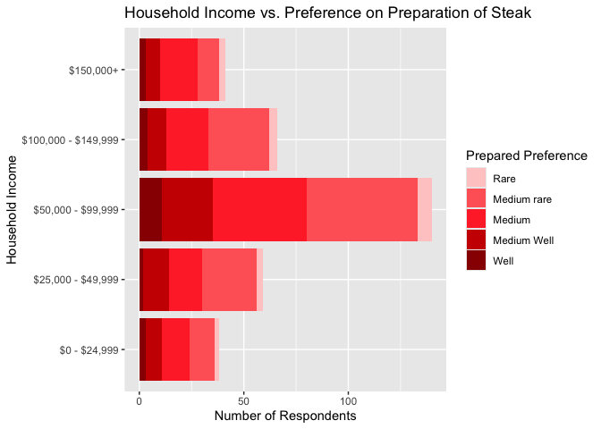<!-- -->

``` r
eat_steak %>% 
  filter(!Household.Income == "", !is.na(Prepared)) %>% 
  mutate(Household.Income = factor(Household.Income, levels = c("$0 - $24,999", "$25,000 - $49,999", "$50,000 - $99,999", "$100,000 - $149,999", "$150,000+"))) %>% 
  mutate(Prepared = factor(Prepared, levels = c("Rare", "Medium rare", "Medium", "Medium Well", "Well"))) %>% 
  group_by(Household.Income, Prepared) %>% 
  summarise(
    prepared_number = n()
  ) %>% 
  ggplot(aes(x = Household.Income, y = prepared_number, fill = Prepared)) + geom_col(position = "fill") + coord_flip() + labs(x = "Household Income", y = "Number of Respondents", fill = "Prepared Preference", title = "Household Income vs. Preference on Preparation of Steak") + scale_fill_manual(values = steak_colors)
```

    ## `summarise()` has grouped output by 'Household.Income'. You can override using
    ## the `.groups` argument.

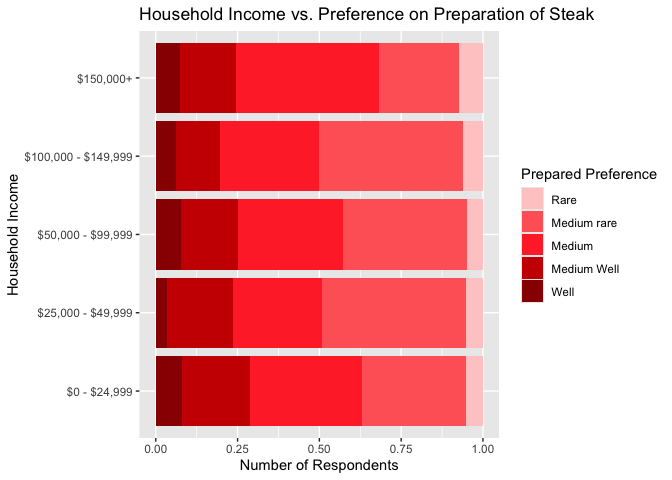<!-- -->

- The relationship between how individuals prefer their steak prepared
  does not appear to differ based on household income. There are some
  slight variations, but no overall trends that appear to stand out.

Overall it does not appear that household income affects whether and
individuals eats steak and how they prefer it to be prepared.

``` r
noNA_alcohol_smoke <- clean_steak %>% 
  filter(!Drink.Alcohol == "" & !Smoke.Cigarettes == "")
total_rows <- nrow(noNA_alcohol_smoke)

noNA_alcohol_smoke %>% 
  group_by(Drink.Alcohol, Smoke.Cigarettes) %>% 
  summarise(
    group_percent = n() / total_rows
  ) %>% 
  ggplot(aes(x = "", y = group_percent, fill = interaction(Drink.Alcohol,Smoke.Cigarettes))) +
  geom_bar(width = 1, stat = "identity") + coord_polar("y") + theme_void() + labs(fill = "Respondents Drink and/or Smoke Respectively", title = "Percentage of Respondents Who Drink and/or Smoke Cigarettes")
```

    ## `summarise()` has grouped output by 'Drink.Alcohol'. You can override using the
    ## `.groups` argument.

<!-- -->

- Looking at this summary, we can see that a greater majority of
  respondents reported that they drink alcohol but do not smoke. There
  is a very little amount of respondents who reported that they do not
  drink but do smoke. These differences will be considered when
  analyzing the relationship between whether they eat steak.

``` r
noNA_alcohol_smoke %>% 
  filter(!Consume.Steak == "") %>% 
  group_by(Drink.Alcohol, Smoke.Cigarettes, Consume.Steak) %>% 
  summarise(
    steak_count = n()
  ) %>% 
  ggplot(aes(x = interaction(Drink.Alcohol,Smoke.Cigarettes), y = steak_count, fill = Consume.Steak)) + geom_col() + labs(title = "Drink Alcohol and/or Smoke Cigarettes vs. Whether Respondent Consumes Steak", x = "Drink Alcohol and/or Smoke Cigarettes Respectively", y = "Number of Respondents", fill = "Whether Respondent Consumes Steak")
```

    ## `summarise()` has grouped output by 'Drink.Alcohol', 'Smoke.Cigarettes'. You
    ## can override using the `.groups` argument.

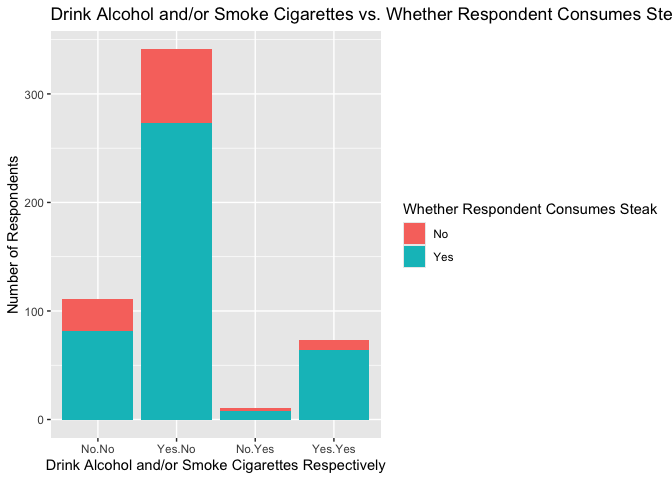<!-- -->

``` r
noNA_alcohol_smoke %>% 
  filter(!Consume.Steak == "") %>% 
  group_by(Drink.Alcohol, Smoke.Cigarettes, Consume.Steak) %>% 
  summarise(
    steak_count = n()
  ) %>% 
  ggplot(aes(x = interaction(Drink.Alcohol,Smoke.Cigarettes), y = steak_count, fill = Consume.Steak)) + geom_col(position = "fill") + labs(title = "Drink Alcohol and/or Smoke Cigarettes vs. Whether Respondent Consumes Steak", x = "Drink Alcohol and/or Smoke Cigarettes Respectively", y = "Number of Respondents", fill = "Whether Respondent Consumes Steak")
```

    ## `summarise()` has grouped output by 'Drink.Alcohol', 'Smoke.Cigarettes'. You
    ## can override using the `.groups` argument.

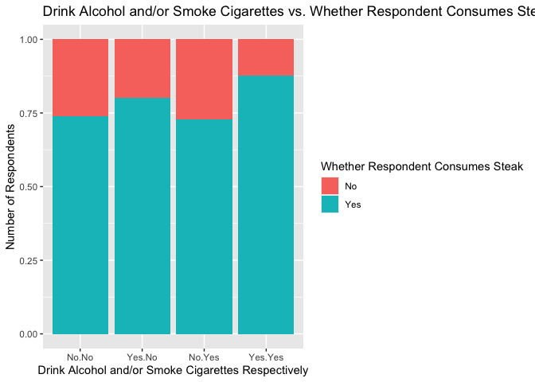<!-- -->

- Analyzing the relationship between whether respondents smoke
  cigarettes and/or drink alcohol, there does not appear to be any major
  trends between the two. Respondents in all four categories tend to
  respond that they do consume steak.

``` r
noNA_alcohol_smoke %>% 
  filter(!Prepared == "" & Consume.Steak == "Yes") %>% 
   mutate(Prepared = factor(Prepared, levels = c("Rare", "Medium rare", "Medium", "Medium Well", "Well"))) %>% 
  group_by(Drink.Alcohol, Smoke.Cigarettes, Prepared) %>% 
  summarise(
    totals_Prepared = n() 
  ) %>% 
  ggplot(aes(x = interaction(Drink.Alcohol, Smoke.Cigarettes), y = totals_Prepared, fill = Prepared)) + geom_col() + labs(title = "Drink Alcohol and/or Smoke Cigarettes vs Preference of Steak Preparation", x = "Drink Alcohol and/or Smoke Cigarettes Respectively", y = "Number of Respondents", fill = "Preparation Preference") + scale_fill_manual(values = steak_colors)
```

    ## `summarise()` has grouped output by 'Drink.Alcohol', 'Smoke.Cigarettes'. You
    ## can override using the `.groups` argument.

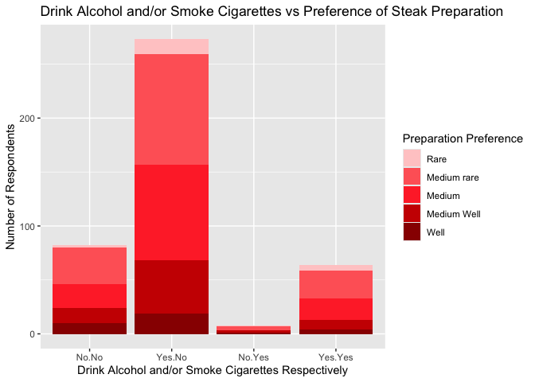<!-- -->

``` r
noNA_alcohol_smoke %>% 
  filter(!Prepared == "" & Consume.Steak == "Yes") %>% 
   mutate(Prepared = factor(Prepared, levels = c("Rare", "Medium rare", "Medium", "Medium Well", "Well"))) %>% 
  group_by(Drink.Alcohol, Smoke.Cigarettes, Prepared) %>% 
  summarise(
    totals_Prepared = n() 
  ) %>% 
  ggplot(aes(x = interaction(Drink.Alcohol, Smoke.Cigarettes), y = totals_Prepared, fill = Prepared)) + geom_col(position = "fill") + labs(title = "Drink Alcohol and/or Smoke Cigarettes vs Preference of Steak Preparation", x = "Drink Alcohol and/or Smoke Cigarettes Respectively", y = "Number of Respondents", fill = "Preparation Preference") + scale_fill_manual(values = steak_colors)
```

    ## `summarise()` has grouped output by 'Drink.Alcohol', 'Smoke.Cigarettes'. You
    ## can override using the `.groups` argument.

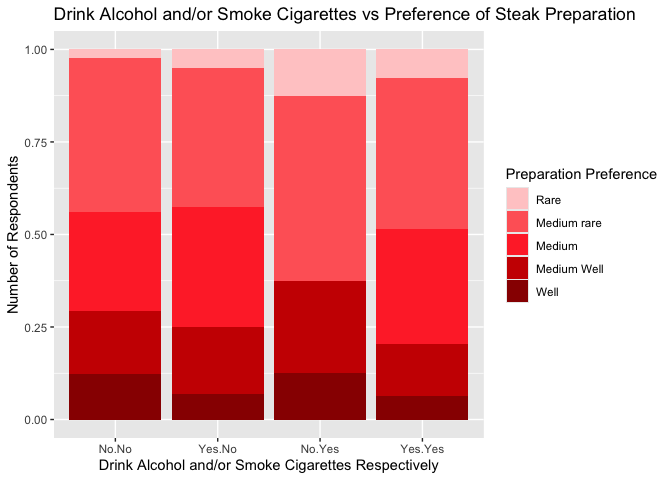<!-- -->

- Analyzing the bar chart, there does appear to be a slight difference
  in the relative number of respondents within the four groups and how
  they prefer their steak prepared. In the No,No and Yes,Yes categories,
  Medium Rare and Medium look to have about the same number of
  respondents relative to their categories. In the Yes,No category,
  Medium Rare appears to be slightly more popular within the category.
  Rare and Well appear to be the least selected in all four groups by a
  significant amount.

Overall, there appears to be very slight differences between the four
groups based on whether they drink alcohol and/or smoke cigarettes, and
whether they respondents consume steak, and if they do, how they prefer
their steak prepared.
